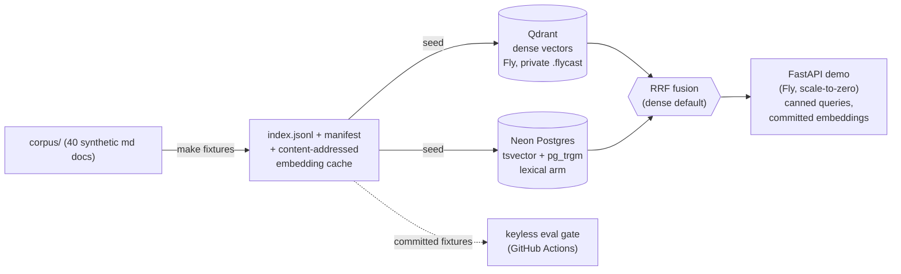

# vault-rag-eval

[](https://github.com/Aquinas-Protocol/vault-rag-eval/actions/workflows/ci.yml)

> Dense + hybrid retrieval over a synthetic corpus, decided by a **keyless** eval
> gate, deployed to a real cloud container. The cloud-deployed sibling of
> [email-triage-ts](https://github.com/Aquinas-Protocol/email-triage-ts): same
> eval discipline, new modality (retrieval), now deployed.

## TL;DR

I built dense and hybrid (dense + lexical) retrieval, then let a reviewed eval set
decide which to ship — instead of guessing. Over **n=48** page-labeled queries:

| query kind | n | hit@5 | recall@10 | mrr@10 |
|---|---|---|---|---|
| paraphrase (conceptual) | 32 | **1.000** | 1.000 | 0.953 |
| exact-identifier | 8 | 0.875 | 0.875 | 0.812 |
| multi-page | 8 | 1.000 | 0.938 | 1.000 |
| **overall (dense, shipped)** | 48 | 0.979 | 0.979 | 0.938 |

**The finding:** dense embeddings are near-perfect on conceptual/paraphrase
queries but **blind to novel exact tokens** — a query for the identifier
`FENCING_EPOCH_ID` retrieves nothing useful from dense. The lexical arm's entire
value is there. On this corpus's mix that nudges hybrid marginally ahead
(recall@10 → 1.000), but the lift is small (n=48 bounds no confidence intervals)
and *entirely* on identifier queries. So **dense ships by default**; the lexical
arm is enabled per-corpus when the queries are identifier-heavy.

The sharper lesson is about evals, not retrieval: **a hybrid-vs-dense verdict is
only as representative as the gold set's query mix.** A paraphrase-heavy gold set
says "dense wins"; one that stresses identifier lookups says "hybrid earns its
keep." The eval is what made that visible. Full argument in the
[writeup](docs/writeup.md).

## Architecture



Two stores by design: dense vectors live in **Qdrant**, lexical/metadata in
**Postgres**. They share deterministic chunk ids so their ranked lists fuse with
Reciprocal Rank Fusion. Embeddings are local **Ollama `nomic-embed-text` @ 768**,
committed as a content-addressed cache — so the whole repo is keyless and
reproducible (swapping to a hosted model is a one-line change pinned to the
collection identity).

## Run it

```bash
make install    # editable install (+ dev deps)
make fixtures    # rebuild index + manifest + embeddings from corpus/ (needs Ollama)
make eval        # score the gold set, keyless, gate on baseline
```

`make eval --sweep` reproduces the dense-vs-hybrid comparison. `make test` runs
the provenance + unit + store tests. The live demo (when up) answers canned
queries: `/demo/d01` shows dense missing an identifier query, `?mode=hybrid` shows
the Postgres lexical arm fixing it. Deploy steps: [deploy/README.md](deploy/README.md).

## Privacy & provenance

Every committed data artifact is **regenerable from `corpus/`** by `make fixtures`,
and CI asserts byte-equality (allowlist inversion: anything not derivable fails the
build). The corpus is 100% synthetic. Secondary guards: `gitleaks` + a hashed
denylist over the tree **and** git history. The repo was authored with a GitHub
noreply identity from the first commit.

## What this does NOT do

- **Synthetic corpus.** 40 hand-authored neutral docs; results don't transfer
  verbatim to a real corpus (they characterize *method*, not a universal verdict).
- **n=48 ranks configs; it does not bound confidence intervals.** Small deltas
  (one query) are within noise.
- **Retrieval only.** It measures whether the right *page* is retrieved, not answer
  faithfulness or generation quality.
- **Single embedding model**, 768 dims. A different model reorders the margins.
- **Paraphrase-heavy by construction** (66%). That choice favors dense; an
  identifier-heavy corpus would favor the lexical arm.
- **Postgres `ts_rank_cd` is full-text ranking, not BM25** (no IDF / TF-saturation
  / length-norm). Exact-identifier recall comes from the `pg_trgm` substring arm,
  because the text-search parser splits identifiers on underscores.

## Layout

| Path | What |
|---|---|
| `corpus/` | 40 synthetic markdown docs (the only source of truth) |
| `src/vrag/` | chunker, ids, embedding cache, in-process retrieval, RRF |
| `src/vrag/stores/` | Qdrant (dense) + Postgres (lexical) adapters |
| `app/` | FastAPI canned-query demo + Dockerfile |
| `fixtures/` | committed index + manifest + content-addressed embedding cache |
| `evals/` | gold set + metrics + sweep + baseline gate |
| `deploy/` | Fly configs + runbook |

## License

MIT
